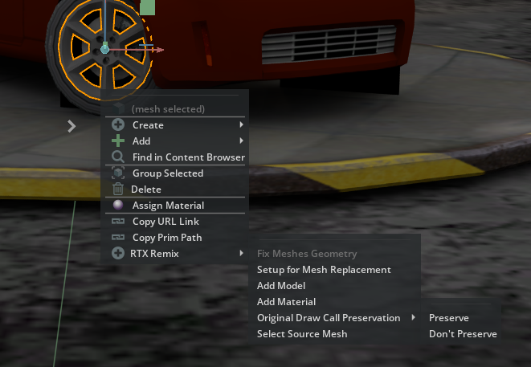

# RTX Remix Tools [ekozerski.rtxremixtools]

Focusing on improving RTX Remix modding workflows, this extension is designed to speed up iteration when producing assets and mods by providing useful UI operations inside Omniverse apps like USD Composer/Create or Code.

It provides some options for the "Right click" context menu to setup ideal replacement assets, as well as some converting operations to ensure assets will be compatible with the Remix runtime.

It is primarily designed to operate on Remix captured scenes, so users can have instant feedbacks on what their mods are gonna look like in the game scenes and iterate faster.

## Available Tools
### Fix Meshes Geometry
<i>(Operation is performed in the mesh source file and can\'t be undone)</i>

Interpolation Mode
- RTX Remix runtime only supports meshes with "vertex" interpolation mode, in which "points" "normals" and "uvs" arrays 
must have the same length, but DCC tools usually export the mesh using "faceVarying" interpolation mode.
This operation reorganizes the geometry to be compatible with the runtime.
- See: "Interpolation of Geometric Primitive Variables" - https://openusd.org/dev/api/class_usd_geom_primvar.html
- This operation only applies for meshes inside the mods folder, not the captured ones.

### Setup for Mesh Replacement
Exports the selected mesh in a selected path, already setting up the replacements and references to work in the runtime, so for every change the user only needs to:
- Open the exported mesh in it's DCC of choice, make the changes and export again (with the right settings, triangulating faces, no materials, etc.)
- Back in OV, refresh the reference to see the changes in the captured scene.
- Use the "Fix Meshes Geometry" again to make it Remix-compatible.
- Enjoy.

The original mesh is kept in case the user only wants to add more models. Make sure to delete it if the intention is to completely replace the original mesh.

### Add Model
If the user already has authored USD models, this option allows to select multiple models and add to the mesh_HASH prim.

### Add Material
This option allows to select a material .MDL file (AperturePBR_Opacity.mdl or AperturePBR_Translucent.mdl) to add a material prim to the mesh_HASH prim.

### Original Draw Call Preservation
Allows to set the "custom int preserveOriginalDrawCall" attribute to indicate whether the runtime should be forced to render the original mesh or not. Must be set to 1 when placing custom lights or else the original mesh disappears. PS: Remember to set this to 0 if you want to make a mesh replacement and remove the original mesh.

### Select Source Mesh
Quick way to select the originial source mesh_HASH prim in the scene when you have an instance prim selected.

 

## Things to Keep in mind
- In a capture scene, any changes made to the "inst_SOMEHASH_x" prims won't show up in the runtime, so every changes must be done in the "mesh_SOMEHASH" they're referencing. Whenever the user clicks a inst_ prim to perform an action like Fixing geometry or Add Model (Ex: Right clicking in the 3D viewport), this tool will try to find the referenced mesh_SOMEHASH and perform the operations in it instead.
- Having that in mind, always keep an eye in the "Layers" tab to check if you have done any changes to the "instances" path. Try to delete those changes as much as possible.
- The only material types that work in the runtime are described in the AperturePBR_Opacity.MDL and AperturePBR_Translucent.MDL, and every mesh must be triangulated. If you want to add a model you got from somewhere else like an asset store, make sure to convert the assets to work in the runtime.
- When placing lights in the scene, it is necesssary to set an int "preserveOriginalDrawCall" to "1" in order to keep rendering the original mesh. If another layer is setting this flag somewhere and you want to replace/remove the original mesh in your own layer, you will notice that the original mesh can't be removed without setting this flag back to "0". You can do that on your own layer, set it back to "0", but make sure your layer comes on top of the other one that sets it to true.
