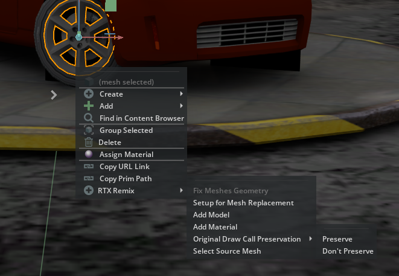

# RTX Remix Tools [ekozerski.rtxremixtools]

Focusing on improving RTX Remix modding workflows, this extension is designed to speed up iteration when producing assets and mods by providing useful UI operations inside Omniverse apps like USD Composer/Create or Code.

It provides some options for the "Right click" context menu to setup ideal replacement assets, as well as some converting operations to ensure assets will be compatible with the Remix runtime.

It is primarily designed to operate on Remix captured scenes, so users can have instant feedbacks on what their mods are gonna look like in the game scenes and iterate faster.

## Available Tools
#### Fix Meshes Geometry
<i>(Operation is performed in the mesh source file and can\'t be undone)</i>
- Interpolation Mode 
  - RTX Remix runtime only supports meshes with "vertex" interpolation mode, in which "points" "normals" and "uvs" arrays 
must have the same length, but DCC tools usually export the mesh using "faceVarying" interpolation mode.
This operation reorganizes the geometry to be compatible with the runtime.
  - See: "Interpolation of Geometric Primitive Variables" - https://openusd.org/dev/api/class_usd_geom_primvar.html
  - This operation only applies for meshes inside the mods folder, not the captured ones.

#### Setup for Mesh Replacement
- Exports the selected mesh in a selected path, already setting up the replacements and references to work in the runtime, so for every change the user only needs to:
  - Open the exported mesh in it's DCC of choice, make the changes and export again (with the right settings, triangulating faces, no materials, etc.)
  - Back in OV, refresh the reference to see the changes in the captured scene.
  - Use the "Fix Meshes Geometry" again to make it Remix-compatible.
  - Enjoy.
- The original mesh is kept in case the user only wants to add more models. Make sure to delete it if the intention is to completely replace the original mesh.